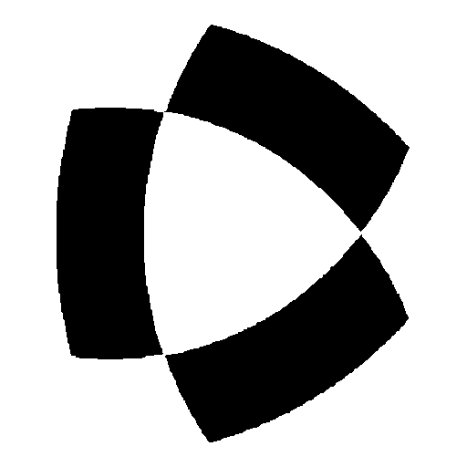

# nonacademicons

Nonacademicons is an icon pack I developed for my personal website. It extends [Academicons](http://jpswalsh.github.io/academicons) with additional icons, not necessarily related to academia. It can be used by itself or in conjunction with Academicons and/or [FontAwesome](https://github.com/FortAwesome/Font-Awesome), as the icons intentionally share the same metrics and can be used with similar CSS syntax.

| Name                   | Image                                             |
| ---------------------- | ------------------------------------------------- |
| `nai-clarivate`        |         |
| `nai-clarivate-square` |  |
| `nai-scopus`           |            |
| `nai-scopus-square`    |     |
| `nai-orcid`            |             |
| `nai-orcid-square`     |      |
| `nai-nextgen`          |           |
| `nai-nextgen-square`   |    |
| `nai-prtr`             |              |
| `nai-prtr-square`      |       |
| `nai-aei`              |               |
| `nai-aei-square`       |        |
| `nai-uc3m-alt`         |          |
| `nai-uc3m-alt-square`  |   |
| `nai-uc3m`             |              |
| `nai-uc3m-square`      |       |
| `nai-lichess`          |           |
| `nai-lichess-square`   |    |

## Usage

There are two ways to use this font on your website. One is to download the `fonts` and `css` folders, copy them to the assets directory of your website, and link to the stylesheet by adding the following line to your HTML head:

```html
<link rel="stylesheet" href="/assets/css/nonacademicons.min.css" />
```

Alternatively, you can use jsDelivr to call the latest release from the content distribution network. In this case, you can add the following line to your HTML head without copying any folder:

```html
<link rel="stylesheet" href="https://cdn.jsdelivr.net/gh/piazzai/nonacademicons@v1.3.0/css/nonacademicons.min.css" />
```

At this point, icons can be deployed in a similar way as Academicons ([read more](https://jpswalsh.github.io/academicons/)), just remember to change the prefix from `ai` to `nai`. Icons can be resized with classes like `nai-lg` or `nai-2x` ([read here](https://fontawesome.com/how-to-use/on-the-web/styling/sizing-icons)). For example:

```html
<i class="nai nai-lichess nai-2x"></i>
```

## License

The Nonacademicons font files (located in the `fonts` folder) are released under the [SIL Open Font License](https://scripts.sil.org/ofl). Every other file included in this repository is released under the [MIT License](https://mit-license.org/).
